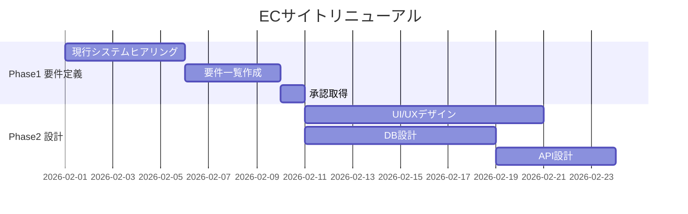

「ガントチャートを作る作業」自体に時間がかかりすぎる問題は、PMなら誰でも経験がある。WBSを書いてから、各タスクの依存関係を整理して、開始日・終了日を手で入力して、ExcelやProjectのバーを調整して……。設計や判断ではなく、単純な転記作業に1〜2時間を使っていた。

ChatGPTはこの転記作業を劇的に短縮できる。WBSのテキストを渡すだけでMermaid記法のガントチャートや、ExcelやNotionに取り込めるCSV形式を出力してくれる。

## ステップ1：WBSをテキストで準備する

まず、WBSを以下のようなシンプルなテキスト形式にまとめる。細かい書式は不要で、箇条書きレベルで十分だ。

```
プロジェクト名：ECサイトリニューアル
開始日：2026年2月1日
期間：3ヶ月

Phase 1 要件定義（2週間）
  - 現行システムヒアリング
  - 要件一覧作成
  - 承認取得

Phase 2 設計（3週間）
  - UI/UXデザイン
  - DB設計
  - API設計

Phase 3 開発（6週間）
  - フロントエンド実装
  - バックエンド実装
  - 結合テスト

Phase 4 リリース準備（1週間）
  - UAT
  - 本番環境構築
  - リリース
```

## ステップ2：ガントチャート生成プロンプト

上記のWBSをChatGPTに渡すプロンプトを示す。

```
以下の【WBS情報】をもとに、Mermaid記法のガントチャートを生成してください。

## 条件
- 各フェーズのタスクは並行・直列の依存関係を適切に設定
- 休日（土日）は除外して営業日ベースで計算
- Mermaid ganttのdateFormatはYYYY-MM-DDを使用
- セクションはフェーズごとに分ける

出力形式：
```mermaid
gantt
  ...
```

【WBS情報】
[上記のWBS情報を貼り付け]
```

## 出力例と実際の使い方

ChatGPTはこのような出力を返す。



このMermaid記法はGitHub、Notion、GitLabで直接レンダリングできる。NotionにEmbedブロックで貼り付けるか、GitHubのREADMEにそのまま書けばガントチャートとして表示される。

## CSV形式で出力させてExcelに取り込む

Mermaidではなく、Excelに取り込みたい場合はCSV形式で出力させる。

```
以下のWBSをCSV形式のガントチャートデータに変換してください。

カラム：タスク名, フェーズ, 担当者, 開始日(YYYY-MM-DD), 終了日(YYYY-MM-DD), 前提タスク, 進捗(%)
担当者は「未定」で埋めてください。
進捗は0%で統一してください。
```

このCSVをExcelに貼り付けてから条件付き書式でガントチャート風の表示にするか、ProjectやSmartsheetにインポートすれば即座に使える。

## 精度を上げる追加指示

**休日・バッファを自動計算させる：**

```
上記のガントチャートに以下の条件を反映して再出力してください：
- 2026年2月11日・3月20日は祝日のため除外
- 各フェーズ終了後に2営業日のバッファを追加
- 全体の終了日を教えてください
```

**依存関係の確認：**

```
上記のガントチャートで、クリティカルパス（遅延するとプロジェクト全体が遅れるタスクの連鎖）を特定して、それぞれのタスクに「[CP]」のマークをつけてください。
```

<AffiliateInline type="saas-tool" />

## 注意点：AIが苦手なこと

ChatGPTはWBSの構造を解釈するのは得意だが、「実際にかかる工数の見積もり」は苦手だ。出力されたガントチャートの日数はあくまでWBSに書かれた期間をそのまま使っているだけなので、エンジニアへの確認は省略しないこと。

また、依存関係の複雑なプロジェクト（並行開発・外部ベンダー待ち・法定手続きなど）は、ChatGPTの出力を叩き台として使い、手動で調整する前提で使うのが現実的だ。

## まとめ

ChatGPTを使ったガントチャート自動生成は、転記作業の削減に特化したユースケースとして即効性が高い。WBSさえ用意できれば、プロンプトを貼り付けるだけで5分以内にガントチャートの原型が完成する。プロジェクト立ち上げのたびに繰り返す作業だからこそ、一度このフローを習得すれば長期的なコスト削減効果は大きい。
